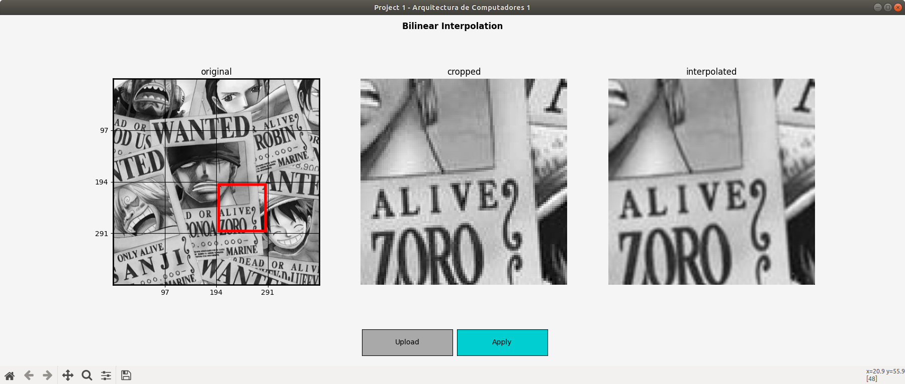

# Bilinear Interpolation
<!-- Improved compatibility of back to top link: See: https://github.com/othneildrew/Best-README-Template/pull/73 -->

<!-- TEC LOGO -->


<!-- PROJECT SHIELDS -->
<!--
*** I'm using markdown "reference style" links for readability.
*** Reference links are enclosed in brackets [ ] instead of parentheses ( ).
*** See the bottom of this document for the declaration of the reference variables
*** for contributors-url, forks-url, etc. This is an optional, concise syntax you may use.
*** https://www.markdownguide.org/basic-syntax/#reference-style-links
-->

[![MIT License][license-shield]][license-url]
[![LinkedIn][linkedin-shield]][linkedin-url]


<!-- TABLE OF CONTENTS -->
<details>
  <summary>Table of Contents</summary>
  <ol>
    <li>
      <a href="#about-the-project">About The Project</a>
    </li>
    <li>
      <a href="#getting-started">Getting Started</a>
      <ul>
        <li><a href="#prerequisites">Prerequisites</a></li>
        <li><a href="#installation">Installation</a></li>
      </ul>
    </li>
    <li><a href="#license">License</a></li>
    <li><a href="#contact">Contact</a></li>
    <li><a href="#acknowledgments">Acknowledgments</a></li>
  </ol>
</details>


<!-- ABOUT THE PROJECT -->
## About The Project
In order to apply the concepts of computer architecture, we propose the design of an application that allows the introduction of an image of at least 390x390, divides it into 16 identical sections and approves the selection of one of these as a candidate to be applied to an interpolation algorithm, the result must be shown to the user to be able to contrast with the original. 


The image processing must be performed entirely by means of an assembler program, while in a high-level language an interface must be exposed to select, apply and view the changes of the chosen image sections.


<p align="right">(<a href="#readme-top">back to top</a>)</p>


<!-- GETTING STARTED -->
## Getting Started

### Python
On a Python default environment, execute interface.py.


### x86
1. Open a terminal (you can use the quick command Ctrl + Alt + T) and go to the project base direction, then execute.
  ```sh
   cd src/asm
   ```
2. To compile, link and run the file, execute.
   ```sh
   nasm -felf64 -o algorithm.o algorithm.asm && ld -o algorithm algorithm.o && ./algorithm
   ```
3. GDB, the GNU Project debugger, allows you to see what is going on `inside` another program while it executes.
It will be used to check the operation of the program in real time.

  * Previously, if desired, the elements of the object code can be explored, using:
  ```sh
  objdump -M intel -d algorithm.o
  gdb algorithm
  ```

  * To run with GDB use:
  ```sh
  gdb algorithm
  ```
  * Several things can be done, but the most useful is to be able to define breakpoints.
    * use 's' to run each loop one at a time.
    ```sh
    s
    ```
    * use 's n' to run `n` loops.
    ```sh
    s 10
    ```

  * To see the status of the registers at a breakpoint, use "info registers":
    * use 'i r' to print the value of all registers.
    ```sh
    i r
    ``` 
    ```sh
    i r
    ``` 
    * use 'i r \<a> \<b> ... \<z>' to print specific registers, where a,b..,z are the corresponding names of these registers.
    ```sh
    i r rax bh sil
    ``` 
For more information about how to use. See [GDB](https://www.sourceware.org/gdb/).


### Prerequisites
Software you need to install to run this project:
```
Python 3.6 or higher (recommended)
Python libraries: pip3, matplotlib, cv2, numpy, tkinter, os
Additional build libraries to compile to x86 NASM
```

### Installation
1. Start by updating the package list using the following command.
   ```sh
   sudo apt update
   ```
2. Clone the repo
   ```sh
   git clone https://github.com/FlowsyCurls/srichards_computer_architecture_1_2022
   ```
   
3. Use the following command to install pip for Python 3.
   ```sh
   sudo apt install python3-pip
   ```
4. Once the installation is complete, use pip to install other needed packages.
   ```sh
   pip3 install opencv-python
   python3 -m pip install -U matplotlib
   pip3 install numpy
   ```
5. Install the NASM package.
   ```sh
   sudo apt update
   sudo apt install nasm gdb
   ```
   
<p align="right">(<a href="#readme-top">back to top</a>)</p>


<!-- LICENSE -->
## License

Distributed under the MIT License. See [LICENSE.md](LICENSE.md) for more information.

<p align="right">(<a href="#readme-top">back to top</a>)</p>


<!-- CONTACT -->
## Contact

Shakime Richards - Computer Engineering Student - [@shakime-r-sparks-25704422a](linkedin-url) - jeykimers.johnson@gmail.com

Project Link: [https://github.com/FlowsyCurls/srichards_computer_architecture_1_2022](https://github.com/FlowsyCurls/srichards_computer_architecture_1_2022)

<p align="right">(<a href="#readme-top">back to top</a>)</p>


<!-- ACKNOWLEDGMENTS -->
## Acknowledgments
* [Choose an Open Source License](https://choosealicense.com)
* [Assembly Programming](https://www.tutorialspoint.com/assembly_programming)
* [NASM Tutorial](https://cs.lmu.edu/~ray/notes/nasmtutorial/)
* Alejandro Ibarra - [AlejandroIbarraC](https://github.com/AlejandroIbarraC)


<p align="right">(<a href="#readme-top">back to top</a>)</p>


<!-- MARKDOWN LINKS & IMAGES -->
<!-- https://www.markdownguide.org/basic-syntax/#reference-style-links -->
[license-shield]: https://img.shields.io/github/license/othneildrew/Best-README-Template.svg?style=for-the-badge
[license-url]: LICENSE.md
[linkedin-shield]: https://img.shields.io/badge/-LinkedIn-black.svg?style=for-the-badge&logo=linkedin&colorB=555
[linkedin-url]: https://www.linkedin.com/in/jeykime/
[product-screenshot]: readme-images/example1.png
